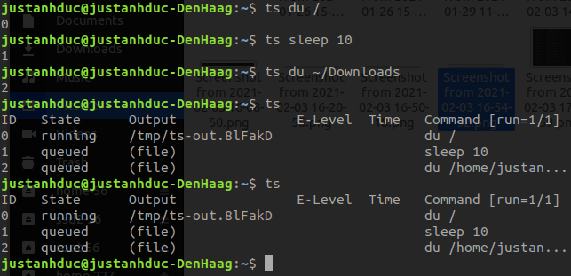

# Task Spooler

Originally, [Task Spooler](https://vicerveza.homeunix.net/~viric/soft/ts/) by Lluís Batlle i Rossell.

## Introduction 

As in freshmeat.net:

> task spooler is a Unix batch system where the tasks spooled run one after the other. The amount of jobs to run at once can be set at any time. Each user in each system has his own job queue. The tasks are run in the correct context (that of enqueue) from any shell/process, and its output/results can be easily watched. It is very useful when you know that your commands depend on a lot of RAM, a lot of disk use, give a lot of output, or for whatever reason it's better not to run them all at the same time, while you want to keep your resources busy for maximum benfit. Its interface allows using it easily in scripts. 

For your first contact, you can read an article at linux.com, 
which I like as overview, guide and examples (original url). 
On more advanced usage, don't neglect the TRICKS file in the package.

### Changelog

See [CHANGELOG](CHANGELOG.md).

## Features

I wrote Task Spooler because I didn't have any comfortable way of running batch jobs in my linux computer. I wanted to:

* Queue jobs from different terminals.
* Use it locally in my machine (not as in network queues).
* Have a good way of seeing the output of the processes (tail, errorlevels, ...).
* Easy use: almost no configuration.
* Easy to use in scripts. 

At the end, after some time using and developing ts, it can do something more:

* It works in most systems I use and some others, like GNU/Linux, Darwin, Cygwin, and FreeBSD.
* No configuration at all for a simple queue.
* Good integration with renice, kill, etc. (through `ts -p` and process groups).
* Have any amount of queues identified by name, writting a simple wrapper script for each (I use ts2, tsio, tsprint, etc).
* Control how many jobs may run at once in any queue (taking profit of multicores).
* It never removes the result files, so they can be reached even after we've lost the ts task list.
* Transparent if used as a subprogram with -nf.
* Optional separation of stdout and stderr. 



## Setup

### Install Task Spooler

To setup Task Spooler with GPU support, one needs to set a `CUDA_HOME` environment variable.
Then, simple run the provided script

```
./install
```
to use CMake, or 
```
./reinstall
```
to use Makefile.

Common problems
* Cannot find CUDA: Did you set a `CUDA_HOME` flag?
* `/usr/bin/ld: cannot find -lnvidia-ml`: This lib lies in `$CUDA_HOME/lib64/stubs`. 
Please append this path to `LD_LIBRARY_PATH`.
Sometimes, this problem persists even after adding the lib path.
Then one can add `-L$(CUDA_HOME)/lib64/stubs` to [this line](./Makefile#L29) in the Makefile.

### Uinstall Task Spooler

```
./uninstall
```
Why would you want to do that anyway?

## Mailing list

I created a GoogleGroup for the program. You look for the archive and the join methods in the taskspooler google group page.

Alessandro Öhler once maintained a mailing list for discussing newer functionalities and interchanging use experiences. I think this doesn't work anymore, but you can look at the old archive or even try to subscribe.

## How it works

The queue is maintained by a server process. This server process is started if it isn't there already. The communication goes through a unix socket usually in /tmp/.

When the user requests a job (using a ts client), the client waits for the server message to know when it can start. When the server allows starting , this client usually forks, and runs the command with the proper environment, because the client runs run the job and not the server, like in 'at' or 'cron'. So, the ulimits, environment, pwd,. apply.

When the job finishes, the client notifies the server. At this time, the server may notify any waiting client, and stores the output and the errorlevel of the finished job.

Moreover the client can take advantage of many information from the server: when a job finishes, where does the job output go to, etc.

## Download

Download the latest version (GPLv2+ licensed): ts-1.0.tar.gz - v1.0 (2016-10-19) - Changelog

Look at the version repository if you are interested in its development.

Андрей Пантюхин (Andrew Pantyukhin) maintains the BSD port.

Alessandro Öhler provided a Gentoo ebuild for 0.4, which with simple changes I updated to the ebuild for 0.6.4. Moreover, the Gentoo Project Sunrise already has also an ebuild (maybe old) for ts.

Alexander V. Inyukhin maintains unofficial debian packages for several platforms. Find the official packages in the debian package system.

Pascal Bleser packed the program for SuSE and openSuSE in RPMs for various platforms.

Gnomeye maintains the AUR package.

Eric Keller wrote a nodejs web server showing the status of the task spooler queue (github project).


## Manual

**NOTE**: `man ts` is not updated (yet).

```
usage: ts [action] [-ngfmdE] [-L <lab>] [-D <id>] [cmd...]
Env vars:
  TS_SOCKET  the path to the unix socket used by the ts command.
  TS_MAILTO  where to mail the result (on -m). Local user by default.
  TS_MAXFINISHED  maximum finished jobs in the queue.
  TS_MAXCONN  maximum number of ts connections at once.
  TS_ONFINISH  binary called on job end (passes jobid, error, outfile, command).
  TS_ENV  command called on enqueue. Its output determines the job information.
  TS_SAVELIST  filename which will store the list, if the server dies.
  TS_SLOTS   amount of jobs which can run at once, read on server start.
  TMPDIR     directory where to place the output files and the default socket.
Long option actions:
  --get_label      || -a [id]   show the job label. Of the last added, if not specified.
  --count_running  || -R        return the number of running jobs
  --last_queue_id  || -q        show the job ID of the last added.
Actions:
  -K       kill the task spooler server
  -C       clear the list of finished jobs
  -l       show the job list (default action)
  -S [num] get/set the number of max simultaneous jobs of the server.
  -t [id]  \"tail -n 10 -f\" the output of the job. Last run if not specified.
  -c [id]  like -t, but shows all the lines. Last run if not specified.
  -p [id]  show the pid of the job. Last run if not specified.
  -o [id]  show the output file. Of last job run, if not specified.
  -i [id]  show job information. Of last job run, if not specified.
  -s [id]  show the job state. Of the last added, if not specified.
  -r [id]  remove a job. The last added, if not specified.
  -w [id]  wait for a job. The last added, if not specified.
  -k [id]  send SIGTERM to the job process group. The last run, if not specified.
  -T       send SIGTERM to all running job groups.
  -u [id]  put that job first. The last added, if not specified.
  -U <id-id>  swap two jobs in the queue.
  -B       in case of full queue on the server, quit (2) instead of waiting.
  -h       show this help
  -V       show the program version
Options adding jobs:
  -n           don't store the output of the command.
  -E           Keep stderr apart, in a name like the output file, but adding '.e'.
  -g           gzip the stored output (if not -n).
  -f           don't fork into background.
  -m           send the output by e-mail (uses sendmail).
  -d           the job will be run after the last job ends.
  -D <id,...>  the job will be run after the job of given IDs ends.
  -W <id,...>  the job will be run after the job of given IDs ends well (exit code 0).
  -L <lab>     name this task with a label, to be distinguished on listing.
  -N <num>     number of slots required by the job (1 default).
```

## Thanks

**Author**
  - Lluís Batlle i Rossell, <lluis@vicerveza.homeunix.net>
  - Duc Nguyen, <adnguyen@yonsei.ac.kr>

**Acknowledgement**
* To Raúl Salinas, for his inspiring ideas
* To Alessandro Öhler, the first non-acquaintance user, who proposed and created the mailing list.
* Андрею Пантюхину, who created the BSD port.
* To the useful, although sometimes uncomfortable, UNIX interface.
* To Alexander V. Inyukhin, for the debian packages.
* To Pascal Bleser, for the SuSE packages.
* To Sergio Ballestrero, who sent code and motivated the development of a multislot version of ts.
* To GNU, an ugly but working and helpful ol' UNIX implementation. 
